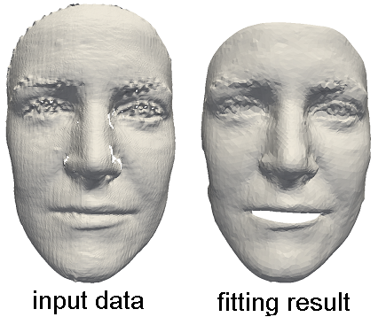

## Template fitting for non-rigid mesh registration

The provided program fits a template mesh to a scan using a non-rigid iterative closet point (ICP) otimization. This template fitting had been used to register the training data of teh statistical models described in the [scientific publication](https://arxiv.org/pdf/1209.6491.pdf).

<p align="center"> 

</p>
Figure: Given an input scan (and optionally 3D landmarks), the provided program minimizes the distance between a template mesh and the scan surface, returning a registered mesh. 

### Setup

The provided code has dependencies on the following libraries:
* Insight Segmentation and Registration Toolkit ITK (http://www.itk.org/). We recommend using ITK 4.50.
* Clapack (http://www.netlib.org/clapack/). Clapack must be compiled using Blas (USE BLAS WRAP must be enabled when using CMake). We recommend using Clapac 3.2.1.
* Approximate Nearest Neighbor Library ANN (http://www.cs.umd.edu/ mount/ANN/). We recommend using ANN 1.1.2.

To setup the provided code, use CMake and specify the required ITK, Clapack and ANN paths. Successfully compiling the project outputs a MM Restricted.exe.

### Basic usage

To run the program, the TemplateFitting.exe must be called with the following 5 parameters, separated by a blank.
* templateMesh.off - full path of the training data template mesh, needed for the mesh structure of the result. This parameter should point to the Template.off.
* templateLmks.txt - full path of a text file containing the landmark (x y z)-coordinates of the template mesh. If the template and the input mesh are already aligned, this parameter can be discarded. This parameter should point to the Template Lmks.txt.
* targetMesh.off - full path of the fitting target mesh. This parameter should point to the Target.off.
* targetLmks.txt - full path of a text file containing the landmark (x y z)-coordinates of the target face mesh. If the template and the input mesh are already aligned, this parameter can be discarded. This parameter should point to the Target Lmks.txt.
* outFitting.off - full path of the fitting result file.

##### Landmarks 
If the TemplateFitting.exe is called without specified landmarks (i.e. without templateLmks.txt and targetLmks.txt), the absolute position and orientation in Euclidean vertex space is used as alignment of the template mesh and the target mesh. The landmark files contain the concatenated (x y z)-coordinates of corresponding salient point sets on the template mesh and the target mesh, whereas all coordinates are separated by a line break. At least four non-coplanar landmarks are required to define a valid rigid alignment.

##### File formats 
While the program provides basic support for WRL-file format and OBJ-file format as input, we recommend using OFF-file format. Only triangle meshes are supported.

##### Configurations 
The header Definitions.h provides parameters to influence the template fitting energy. See the provided comments at the header file for more details. Example: The example TemplateFittingTest.cmd fits the template mesh Template.off to the target mesh Target.off. The template mesh and the target mesh are aligned using the landmarks TemplateLmks.txt for the template, and landmarks TargetLmks.txt for the target mesh. To run the example, the path for the ANN library must be adjusted within the TemplateFittingTest.cmd. By exchanging the parameters, this can be used to fit any other template to any other target mesh.


### License
The source is provided for NON-COMMERCIAL RESEARCH PURPOSES only, and is provided as is WITHOUT ANY WARRANTY; without even the implied warranty of fitness for a particular purpose. The redistribution of the code is not permitted.

### Citing

When using this code in a scientific publication, please cite 
```
@article{Brunton:CVIU:2014:Review,
  title = {Review of statistical shape spaces for {3D} data with comparative analysis for human faces},
  author = {Brunton, Alan and Salazar, Augusto and Bolkart, Timo and Wuhrer, Stefanie},
  journal={Computer Vision and Image Understanding},
  volume={128},
  pages={1--17},
  year={2014}
}
```
